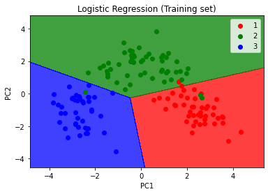
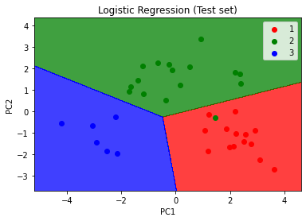

# Dimensionality-Reduction
Here Three different(more specifically two dimensionality reduction algorithms such as Principal Component Analysis, Linear Decreament Analysis(LDA) and Kernel PCA has been used for dimensionality reduction tasks.
Here wine dataset has been reduced from dimensionality of 20 to 2 and then classified using simple logistic regression algorithm. 

